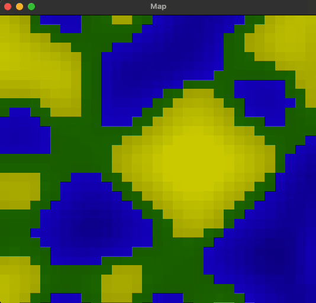

# tiles-rs: Tile Map Generator and Renderer

This project demonstrates a tile map generator and renderer built with Rust, utilizing `ggez` for rendering and `rusqlite` for storing the generated maps in a SQLite database. It features dynamic map generation, where users can regenerate and store maps with a simple key press.



## Features

- 2D tile map generation with different biomes (Forest, Desert, Water).
- Real-time rendering of the generated map using `ggez`.
- Map storage functionality with SQLite using `rusqlite`.
- Dynamic regeneration of maps and database storage with the press of a key.

## Getting Started

### Prerequisites

Ensure you have Rust and Cargo installed on your system. You can install them from [the official Rust website](https://www.rust-lang.org/tools/install).

### Installation

1. Clone the repository:

```sh
git clone https://github.com/microchipgnu/tiles-rs.git
cd tiles-rs
```

2. Build the project:

```sh
cargo build
```

3. Run the application:

```sh
cargo run
```

### Controls

- **R**: Regenerate the map and store it in the database.
- **Escape**: Quit the application.

## Project Structure

- `src/main.rs`: Entry point of the application and event handling.
- `src/map_generator.rs`: Contains the logic for generating the map.
- `src/tiles.rs`: Defines the `Tile`, `Biome`, and `Map` structures.
- `src/db.rs`: Handles storing the map in a SQLite database.

## Dependencies

- `ggez`: For rendering the tile map.
- `rusqlite`: For SQLite database interactions.
- `noise`: For generating Perlin noise used in map generation.
- `rand`: For generating random numbers and offsets in map generation.

## Contributing

Contributions are welcome! Please feel free to submit a pull request or open an issue if you have suggestions or improvements.

## License

This project is licensed under the MIT License - see the LICENSE file for details.
